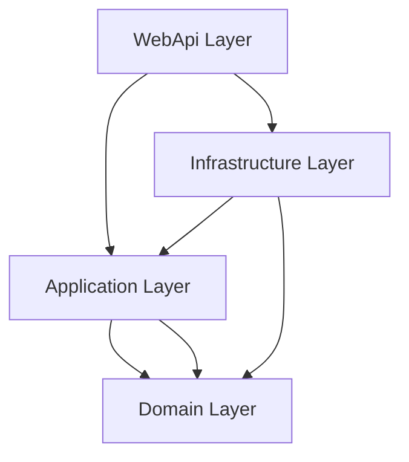
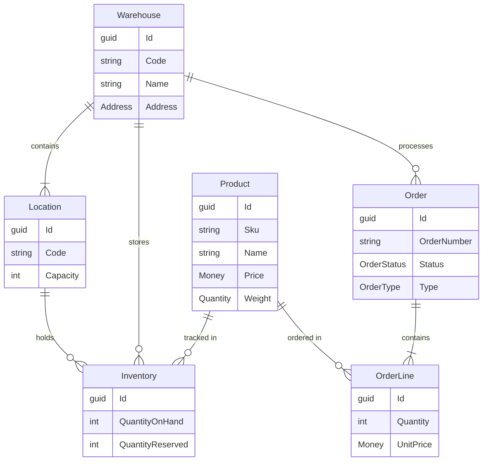

# DDD Architecture Design

## Overview

This WMS application follows Domain-Driven Design (DDD) principles and Clean Architecture to create a maintainable, testable, and scalable system.

## Architecture Layers



### 1. Domain Layer (Core)

The innermost layer containing business logic and rules.

**Responsibilities:**

- Define core business entities
- Implement business rules and invariants
- Define repository interfaces
- Raise domain events

**Key Components:**

- **Entities**: Product, Warehouse, Location, Inventory, Order, OrderLine
- **Value Objects**: Address, Money, Quantity
- **Domain Events**: StockIncreased, StockReserved, etc.
- **Interfaces**: IRepository, IProductRepository, IUnitOfWork

**Principles:**

- No dependencies on other layers
- Pure business logic
- Rich domain model with behavior
- Immutable value objects

### 2. Application Layer

Orchestrates domain objects to implement use cases.

**Responsibilities:**

- Define application services
- Implement CQRS commands and queries
- Coordinate workflows
- Handle cross-cutting concerns

**Key Components:**

- **Commands**: CreateProduct, UpdateProduct
- **Queries**: GetProductById, GetAllProducts
- **Handlers**: Command and Query handlers
- **DTOs**: Data transfer objects
- **Validators**: Input validation rules

**Patterns:**

- CQRS (Command Query Responsibility Segregation)
- Mediator pattern via MediatR
- Result pattern for error handling

### 3. Infrastructure Layer

Implements external concerns and infrastructure services.

**Responsibilities:**

- Database access via EF Core
- Repository implementations
- External service integrations
- Cross-cutting concerns

**Key Components:**

- **DbContext**: EF Core database context
- **Repositories**: Concrete repository implementations
- **Migrations**: Database schema migrations
- **Configurations**: Entity configurations

**Technologies:**

- Entity Framework Core 9
- SQL Server
- AutoMapper

### 4. Presentation Layer (WebApi)

Handles HTTP requests and responses.

**Responsibilities:**

- Expose RESTful API endpoints
- Handle HTTP requests/responses
- API documentation
- Dependency injection registration

**Key Components:**

- **Controllers**: API endpoint controllers
- **Middleware**: Request/response pipeline
- **Filters**: Action filters, exception filters
- **Configuration**: Startup configuration

## Design Patterns

### CQRS (Command Query Responsibility Segregation)

Separates read and write operations:

**Commands:**

- Modify state
- Return simple results or void
- Validated before execution
- Example: CreateProductCommand

**Queries:**

- Read data
- Return DTOs
- No side effects
- Example: GetProductByIdQuery

### Repository Pattern

Abstracts data access:

```csharp
public interface IProductRepository : IRepository<Product>
{
    Task<Product?> GetBySkuAsync(string sku);
    Task<bool> ExistsAsync(string sku);
}
```

### Unit of Work Pattern

Manages transactions and coordinates multiple repositories:

```csharp
public interface IUnitOfWork
{
    Task<int> SaveChangesAsync();
    Task BeginTransactionAsync();
    Task CommitTransactionAsync();
}
```

### Domain Events

Communicate state changes within the domain:

```csharp
public record StockIncreasedEvent(Guid InventoryId, Guid ProductId, int Quantity)
    : IDomainEvent;
```

## Value Objects

Immutable objects defined by their attributes:

**Address:**

- Street, City, State, PostalCode, Country
- Validation in factory method
- Immutable record type

**Money:**

- Amount and Currency
- Arithmetic operations
- Currency matching validation

**Quantity:**

- Value and Unit
- Unit conversions
- Arithmetic operations

## Entity Relationships



## Dependency Flow

```
WebApi → Application → Domain
   ↓          ↓
Infrastructure
```

- **Domain**: No dependencies (pure business logic)
- **Application**: Depends on Domain
- **Infrastructure**: Depends on Domain and Application
- **WebApi**: Depends on Application and Infrastructure

## Testing Strategy

### Unit Tests

- Domain logic (entities, value objects)
- Application handlers
- Pure functions without external dependencies

### Integration Tests

- Repository implementations
- Database operations
- API endpoints

### Test Projects

- `WMS.Domain.Tests`: Domain unit tests
- `WMS.Application.Tests`: Application unit tests
- `WMS.Integration.Tests`: Integration tests (future)

## Best Practices

1. **Separation of Concerns**: Each layer has distinct responsibilities
2. **Dependency Inversion**: Depend on abstractions, not concretions
3. **Single Responsibility**: Each class has one reason to change
4. **Immutability**: Value objects are immutable
5. **Encapsulation**: Entities protect their invariants
6. **Explicit Dependencies**: Constructor injection
7. **Domain Events**: Communicate state changes
8. **Rich Domain Model**: Business logic in entities, not services

## Future Enhancements

- Event Sourcing for audit trail
- Multi-tenancy support
- Advanced caching strategies
- Message queue integration
- Real-time notifications via SignalR
- Advanced reporting and analytics
